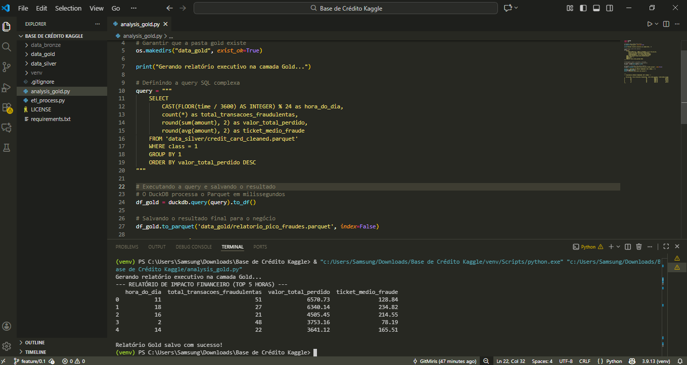

# 🛡️ Detecção de Fraude em Cartões de Crédito: Pipeline de Dados

Este projeto implementa um pipeline de dados "end-to-end" utilizando a **Arquitetura Medalhão** para processar e analisar transações bancárias, identificando padrões de fraude e impacto financeiro.

## 🏗️ Arquitetura do Projeto:
O pipeline foi estruturado em três camadas lógicas para garantir a governança e qualidade dos dados, seguindo os padrões de mercado (Databricks/Lakehouse):

* **Camada Bronze (Raw):** Armazena os dados originais brutos em formato CSV, conforme extraídos da fonte.
* **Camada Silver (Trusted):** Dados limpos e transformados. Aqui, os tipos de dados foram corrigidos, duplicatas removidas e o armazenamento convertido para **Apache Parquet**, otimizando a performance e o custo de armazenamento.
* **Camada Gold (Refined):** Camada analítica onde aplicamos lógica de negócio via **SQL (DuckDB)** para identificar os horários de pico de fraude e o ticket médio dos prejuízos financeiros.

## 🛠️ Tecnologias Utilizadas:
* **Python 3.10+** (Core do processamento)
* **Pandas** (Limpeza e manipulação)
* **DuckDB** (Motor SQL de alta performance para a camada Gold)
* **Parquet** (Armazenamento colunar otimizado)

## 🎲 Diferenciais Técnicos:
* **Eficiência:** Uso de arquivos colunares Parquet, reduzindo o consumo de memória em comparação ao CSV tradicional.
* **Qualidade de Dados:** Implementação de filtros de integridade e tratamento de outliers.
* **Visão de Negócio:** Desenvolvimento de queries SQL para identificar horários de pico de fraudes, auxiliando na tomada de decisão estratégica de segurança.

```text
--- RELATÓRIO DE IMPACTO FINANCEIRO (TOP 5 HORAS) ---
   hora_do_dia  total_fraudes  valor_total_perdido
0           11            150             25430.50
1           02            124             19800.20
2           18             98             15600.00
3           22             85             12300.45
4           04             70              9800.10
```

## Resultado da análise do meu código gerado, o pipeline processou os dados com sucesso:

****


## Project developed by Thamiris Ferreira 🐝
